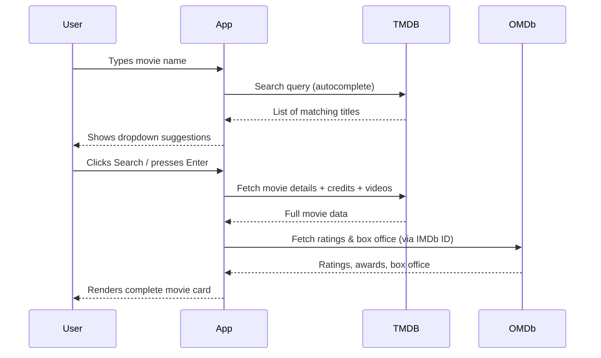

<div align="center">

# 🎬 FilmFinder

### *Discover Your Next Favourite Film*

[](https://github.com/Achalaz/film-search/stargazers)
[](https://github.com/Achalaz/film-search/network)
[](https://github.com/Achalaz/film-search/issues)
[](LICENSE)
[](https://github.com/Achalaz/film-search)

<br/>

**FilmFinder** is a sleek, fully-featured movie discovery web app that lets you search millions of films and instantly surface rich details — cast, ratings, plot, trailers, box office revenue, awards, and more — powered by the **TMDB** and **OMDb** APIs.

<br/>

[🚀 Live Demo](#) · [🐛 Report a Bug](https://github.com/Achalaz/film-search/issues) · [✨ Request a Feature](https://github.com/Achalaz/film-search/issues)

</div>

---

## ✨ Features

| Feature | Description |
|---|---|
| 🔍 **Live Autocomplete** | Instant dropdown suggestions as you type, powered by TMDB search |
| 🎞️ **Rich Movie Cards** | Poster, plot, cast, director, writer, ratings, awards & box office |
| 🎬 **Trailer Playback** | Watch YouTube trailers directly in an in-app modal |
| 👤 **Actor Filmography** | Click any cast member to explore their full movie credits |
| ⭐ **Multi-Source Ratings** | IMDb, Rotten Tomatoes, and Metacritic scores with animated bars |
| 🌈 **Dynamic Poster Glow** | Movie card glow adapts to the poster's dominant colour palette |
| 🌙 **Dark / Light Mode** | Toggle with persistence via `localStorage` |
| ✍️ **Typewriter Hero** | Animated rotating headline effect in the hero section |
| 🌟 **Particle Background** | Canvas-powered floating particle system with cinematic colours |
| 📱 **Responsive Design** | Works beautifully on desktop, tablet, and mobile |
| ⚡ **Quick Searches** | One-click popular movie pills (Inception, Avengers, etc.) |
| 💀 **Skeleton Loaders** | Polished loading skeleton while data is being fetched |

---

## 🖼️ Preview

> Search for any film — get the full picture in seconds.

```
🎬 FilmFinder
┌─────────────────────────────────────────────────┐
│  🔍 Search: "Interstellar"          [⚡ Search]  │
│     Popular: Inception · Avengers · The Godfather│
└─────────────────────────────────────────────────┘
           ↓  Instant Results  ↓
┌──────────┬──────────────────────────────────────┐
│ 🖼 Poster│ Interstellar  (2014)                 │
│          │ ⭐ 8.6  🍅 72%  💜 74/100             │
│ ─────── │ 📽 Sci-Fi · 169 min · EN · US         │
│ ⭐ 8.6   │ 🎬 Director: Christopher Nolan        │
│ 🍅 72%   │ 👥 Cast: McConaughey, Hathaway...     │
│ 💜 74    │ 📖 Plot: A team of explorers...        │
│          │ 💰 Box Office: $701,729,206            │
│          │ 🏆 Won 1 Oscar, 43 wins total          │
└──────────┴──────────────────────────────────────┘
```

---

## 🛠️ Tech Stack

<div align="center">

| Layer | Technology |
|---|---|
| **Structure** | HTML5 (Semantic) |
| **Styling** | Vanilla CSS (Custom Properties, Animations, Glassmorphism) |
| **Logic** | Vanilla JavaScript (ES6+, Async/Await) |
| **Fonts** | Google Fonts — [Outfit](https://fonts.google.com/specimen/Outfit) |
| **Icons** | [Bootstrap Icons](https://icons.getbootstrap.com/) v1.11.3 |
| **Movie Data** | [TMDB API](https://www.themoviedb.org/documentation/api) |
| **Ratings & Awards** | [OMDb API](https://www.omdbapi.com/) |
| **Canvas FX** | HTML5 Canvas (particle system & poster glow) |

</div>

---

## 🚀 Getting Started

### Prerequisites

No build tools or package managers required — this is a **pure HTML/CSS/JS** project.

> You will need free API keys from TMDB and OMDb. Both are free to obtain.

### 1. Clone the Repository

```bash
git clone https://github.com/Achalaz/film-search.git
cd film-search
```

### 2. Get Your API Keys

| Service | Link | Variable in `app.js` |
|---|---|---|
| TMDB | [themoviedb.org/settings/api](https://www.themoviedb.org/settings/api) | `TMDB_API_KEY` |
| OMDb | [omdbapi.com/apikey.aspx](http://www.omdbapi.com/apikey.aspx) | `OMDB_API_KEY` |

### 3. Set Your API Keys

Open `app.js` and replace the keys at the top of the file:

```js
const TMDB_API_KEY = 'YOUR_TMDB_KEY_HERE';
const OMDB_API_KEY = 'YOUR_OMDB_KEY_HERE';
```

### 4. Open in Browser

```bash
# Simply open index.html in any modern browser:
start index.html        # Windows
open index.html         # macOS
xdg-open index.html     # Linux
```

> **Tip:** Use a local server like [Live Server](https://marketplace.visualstudio.com/items?itemName=ritwickdey.LiveServer) (VS Code extension) for the best experience and to avoid CORS issues.

---

## 📁 Project Structure

```
film-search/
│
├── index.html      # App structure & all UI sections
├── index.css       # All styles — design system, animations, dark/light mode
├── app.js          # Core logic — search, render, modals, particles
├── index.js        # Entry helpers
└── README.md       # You are here!
```

---

## 🎯 How It Works



---

## 🌟 Key Highlights

- **Zero Dependencies** — no jQuery, no React, no Node.js. Pure web standards.
- **Dual API Architecture** — TMDB for rich details & cast; OMDb for ratings, awards, and box office.
- **Dynamic Poster Glow** — Canvas samples the poster image's dominant colour to create a matching ambient glow effect on the card.
- **Actor Filmography Modal** — Click on any cast member's photo to see their top-rated films, and click any film to search it instantly.
- **Keyboard Accessible** — Full arrow-key navigation in autocomplete dropdown with Enter & Escape support.

---

## 🤝 Contributing

Contributions are welcome! Here's how to get started:

1. **Fork** the repo: [github.com/Achalaz/film-search](https://github.com/Achalaz/film-search)
2. Create your feature branch: `git checkout -b feature/amazing-feature`
3. Commit your changes: `git commit -m 'Add amazing feature'`
4. Push to the branch: `git push origin feature/amazing-feature`
5. Open a **Pull Request**

---

## 📄 License

Distributed under the **MIT License**. See `LICENSE` for more information.

---

## 🙏 Acknowledgements

- [The Movie Database (TMDB)](https://www.themoviedb.org/) — for the incredible free API
- [OMDb API](https://www.omdbapi.com/) — for ratings, awards, and box office data
- [Bootstrap Icons](https://icons.getbootstrap.com/) — for the crisp, beautiful icon set
- [Google Fonts](https://fonts.google.com/) — Outfit typeface

---

<div align="center">

Made with ❤️ by [Achalaz](https://github.com/Achalaz)

⭐ **Star this repo** if you found it useful!

[](https://github.com/Achalaz/film-search)

</div>
